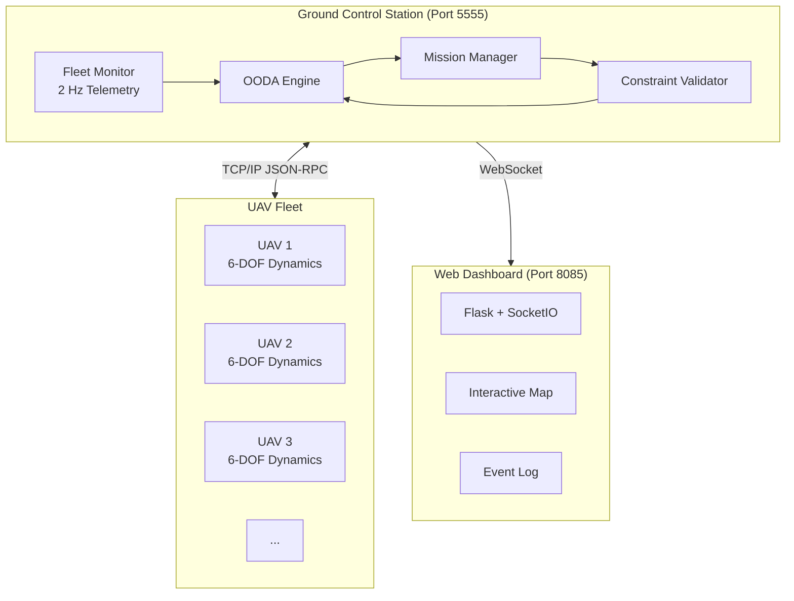
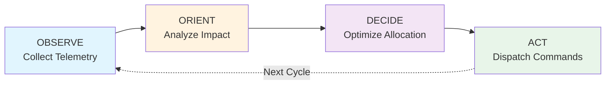
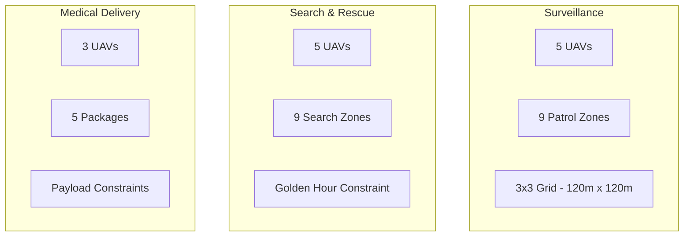
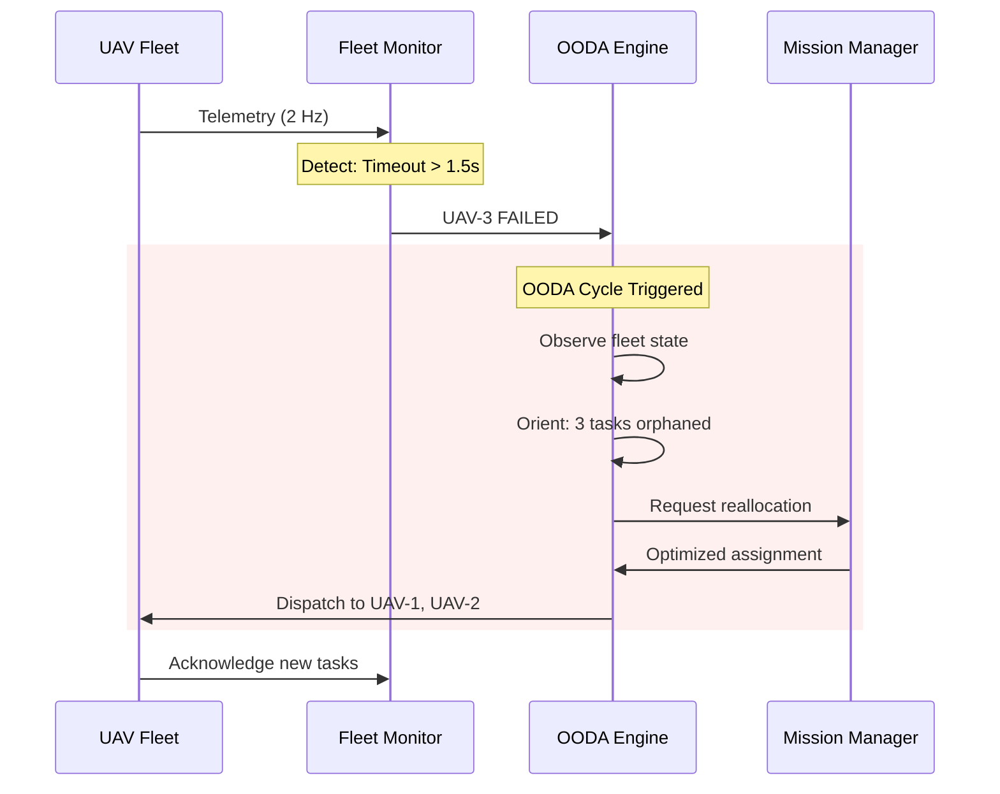
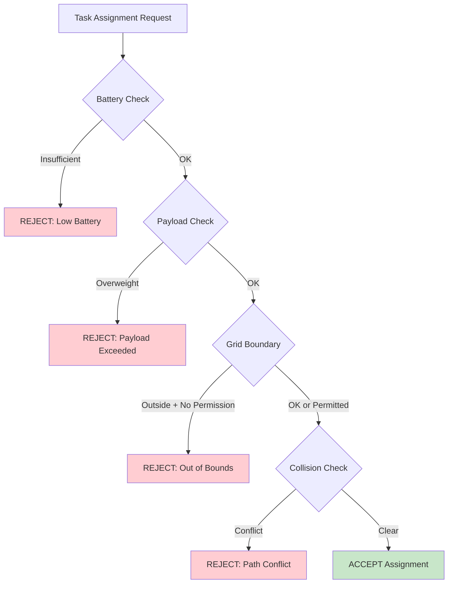

# Constraint-Aware Fault-Tolerant Multi-Agent UAV System

[](https://www.python.org/downloads/)
[](#testing)
[](#license)

> **OODA loop demonstration platform for autonomous drone fleet management with real-time failure recovery.**

<p align="center">
  
</p>

## Quick Start

```bash
# 1. Clone and enter directory
git clone https://github.com/vriez/uav_system.git
cd uav_system

# 2. Install uv (fast Python package manager)
curl -LsSf https://astral.sh/uv/install.sh | sh

# 3. Install dependencies
uv sync

# 4. Run the dashboard
make dash
```

**Open browser:** http://localhost:8085

---

## System Architecture



## OODA Loop Decision Cycle

When a UAV failure is detected, the system executes a four-phase decision cycle:



| Phase | Duration | Actions |
|-------|----------|---------|
| **Observe** | ~0.3ms | Aggregate fleet telemetry, detect anomalies |
| **Orient** | ~0.3ms | Assess mission impact, identify affected tasks |
| **Decide** | ~0.4ms | Greedy allocation + local search optimization |
| **Act** | ~0.2ms | Dispatch task updates to operational UAVs |

**Total cycle time: 0.2-1.2 milliseconds** (~4,000× faster than human reaction)

---

## Mission Scenarios



| Scenario | Fleet | Tasks | Key Constraint |
|----------|-------|-------|----------------|
| **Surveillance** | 5 UAVs | 9 zones | Zone contiguity |
| **Search & Rescue** | 5 UAVs | 9 zones | Time-critical (golden hour) |
| **Medical Delivery** | 3 UAVs | 5 packages | Payload capacity (kg) |

---

## Failure Detection & Recovery



### Failure Modes Detected

| Mode | Detection Method | Threshold |
|------|------------------|-----------|
| **Communication Loss** | Heartbeat timeout | > 1.5 seconds |
| **Battery Anomaly** | Discharge rate spike | > 5% per 30s |
| **Position Jump** | GPS discontinuity | > 100m sudden move |
| **Altitude Violation** | Boundary check | > 50m deviation |

---

## Reproducibility Guide

### Prerequisites

- **Python 3.11+**
- **uv** (recommended) or pip
- **Git**

### Step-by-Step Setup

```bash
# Clone repository
git clone https://github.com/vriez/uav_system.git
cd uav_system

# Option A: Using uv (recommended - 100x faster)
curl -LsSf https://astral.sh/uv/install.sh | sh
uv sync

# Option B: Using pip
pip install -r requirements.txt
```

### Verify Installation

```bash
# Run test suite (169 tests, ~0.22s)
make test

# Expected output:
# ==================== 169 passed in 0.22s ====================
```

### Run Experiments

```bash
# Run all baseline comparison experiments
make experiments

# Or run individually
uv run python run_experiments.py
```

### Launch Modes

| Command | Description | Use Case |
|---------|-------------|----------|
| `make dash` | Dashboard only | Quick demo, presentations |
| `make gui` | Full system + GUI | Development, testing |
| `make launch` | Full system (headless) | Automation, CI/CD |
| `make gcs` | GCS server only | Manual UAV connection |

---

## Project Structure

```
uav_system/
├── gcs/                    # Ground Control Station
│   ├── ooda_engine.py      # Core OODA loop implementation
│   ├── fleet_monitor.py    # Telemetry & failure detection
│   ├── constraint_validator.py
│   └── mission_manager.py
├── uav/                    # UAV Simulation
│   ├── simulation.py       # 6-DOF dynamics, PID control
│   └── client.py           # GCS communication
├── visualization/          # Web Dashboard
│   └── web_dashboard.py    # Flask + SocketIO
├── config/                 # Configuration
│   ├── gcs_config.yaml     # OODA parameters
│   └── uav_config.yaml     # UAV dynamics
├── missions/               # Mission definitions
│   └── test_scenario.yaml
├── tests/                  # Test suite (169 tests)
│   ├── unit/
│   ├── integration/
│   └── regression/
└── docs/                   # Documentation
```

---

## Key Configuration Parameters

### GCS (`config/gcs_config.yaml`)

```yaml
ooda_engine:
  telemetry_rate_hz: 2.0          # Fleet polling frequency
  timeout_threshold_sec: 1.5       # Failure detection threshold

constraints:
  battery_safety_reserve_percent: 20.0

collision_avoidance:
  safety_buffer_meters: 15.0
```

### UAV (`config/uav_config.yaml`)

```yaml
dynamics:
  mass_kg: 1.5
  arm_length_m: 0.225

battery:
  capacity_wh: 100.0
  efficiency_m_per_wh: 150.0

control:
  position_gains: [2.0, 2.0, 5.0]
```

---

## Testing

```bash
# Full test suite
make test

# By category
make test-unit         # 53 unit tests
make test-integration  # 81 integration tests
make test-regression   # 15 regression tests

# With coverage report
make test-coverage

# Specific tests
uv run pytest -k "battery"
uv run pytest tests/integration/ -k "surveillance" -vv
```

---

## Constraint Validation Flow



---

## Experimental Results Summary

| Experiment | Strategy | Coverage | Time | Safe |
|------------|----------|----------|------|------|
| S5 Surveillance | OODA | 100% | 0.66ms | Yes |
| R5 Search & Rescue | OODA | 100% | 1.17ms | Yes |
| R6 SAR Out-of-Grid | OODA | 100% | 0.29ms | Yes |
| D6 Delivery | OODA | 0%* | 0.16ms | Yes |
| D7 Delivery Out-of-Grid | OODA | 0%* | 0.42ms | Yes |

*\*Correct behavior: escalates to operator when constraints prevent safe reallocation*

**Key Finding:** Greedy strategies achieve 100% coverage but violate safety constraints. OODA prioritizes safety over coverage.

---

## Troubleshooting

<details>
<summary><b>UAVs won't connect</b></summary>

- Ensure GCS is running first: `make gcs`
- Check port availability: `lsof -i :5555`
- Verify `gcs_config.yaml` host/port settings

</details>

<details>
<summary><b>Dashboard not loading</b></summary>

- Check port 8085: `lsof -i :8085`
- Clear browser cache
- Check Flask logs for errors

</details>

<details>
<summary><b>OODA cycle not triggering</b></summary>

- Enable debug logging: `LOG_LEVEL=DEBUG make gui`
- Verify UAV has assigned tasks
- Check failure detection thresholds in config

</details>

---

## References

- **Thesis:** "Constraint-Aware Fault-Tolerant Control for Multi-Agent UAV Systems"
- **Quadcopter Dynamics:** Adapted from [bobzwik/Quadcopter_SimCon](https://github.com/bobzwik/Quadcopter_SimCon)

---

## Author

**Vítor Eulálio Reis**

Developed as part of the Specialization in Aeronautical Systems at the School of Engineering of São Carlos, University of São Paulo (EESC-USP).

---

## AI Disclosure

This project was developed with assistance from large language models:

- **Claude** (Anthropic): Software development, experimentation, UI design
- **Gemini** (Google): Literature survey, linguistic refinement
- **ChatGPT** (OpenAI): Simulated peer review

All technical decisions, system architecture, and algorithm design are the author's own work.

---

## License

See project specifications document.
